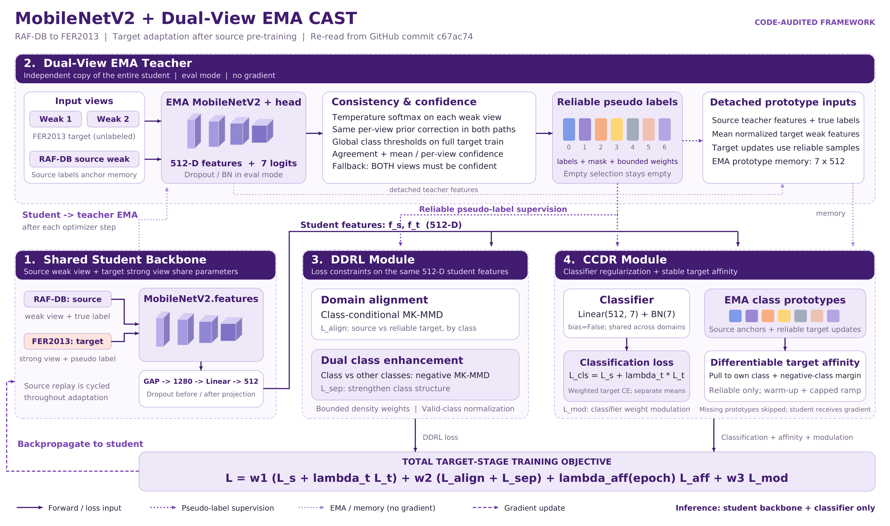

# CAST

This is a PyTorch implementation of the paper:

"Unsupervised Cross-Domain Facial Expression Recognition via Class Adaptive self-Training"
## Environment
Ubuntu 16.04 LTS, python 3.8, pytorch 1.8.1
## Datasets
[RAFDB](http://www.whdeng.cn/raf/model1.html),
[AFE](https://github.com/HCPLab-SYSU/CD-FER-Benchmark),
[EXPW](http://mmlab.ie.cuhk.edu.hk/projects/socialrelation/index.html),
[SFEW](https://paperswithcode.com/dataset/sfew),
[FER2013](https://paperswithcode.com/dataset/fer2013)


## Current experiment: prototype recovery v2

See [new log diagnosis, recovery defaults and source balancing ablation](RECOVERY_V2.md).
Temporal filtering and soft supervision are now opt-in; defaults preserve dual-view prototype supervision.

```bash
bash scripts/run_recovery.sh
```

Behavioral tests: `python -m unittest discover -s tests -v`.

The recovery script reuses the previous prototype experiment's source checkpoint.
For a fresh 30+30 epoch run, use `bash scripts/run_temporal_consistency.sh`.
See [historical temporal v1 implementation](EXPERIMENT_TEMPORAL_CONSISTENCY.md) for the earlier experiment.

## MobileNetV2 dual-view EMA baseline

See [baseline implementation changes and training commands](IMPROVEMENTS.md).
The architecture figure below describes that baseline; the temporal additions are documented above.

[Code-audited architecture and figure downloads](docs/ARCHITECTURE.md)


